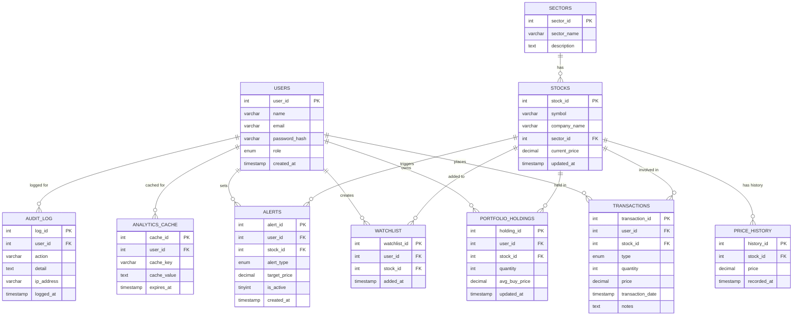

# Quantfolio — Stock Portfolio Analytics & Investment Intelligence Platform

<div align="center">


**A full-stack, database-driven financial analytics platform for tracking stock investments, portfolio performance, and sector diversification — built with Java Servlets, JSP/JSTL, MySQL, and Chart.js.**

[Features](#3-feature-overview) • [Architecture](#4-system-architecture) • [Database Design](#5-database-design) • [ER Diagram](#6-er-diagram) • [Setup](#12-installation--setup) • [Analytics Engine](#9-portfolio-analytics-engine)

</div>

---

## Table of Contents

1. [Purpose & Problem Statement](#1-purpose--problem-statement)
2. [Similar Existing Platforms](#2-similar-existing-platforms)
3. [Feature Overview](#3-feature-overview)
4. [System Architecture](#4-system-architecture)
5. [Database Design](#5-database-design)
6. [ER Diagram](#6-er-diagram)
7. [Technology Stack](#7-technology-stack)
8. [Module-wise Breakdown](#8-module-wise-breakdown)
9. [Portfolio Analytics Engine](#9-portfolio-analytics-engine)
10. [Security Implementation](#10-security-implementation)
11. [User Interface](#11-user-interface)
12. [Installation & Setup](#12-installation--setup)
13. [Project Structure](#13-project-structure)
14. [Demo Credentials](#14-demo-credentials)
15. [Advanced SQL Features](#15-advanced-sql-features)
16. [Desktop Application](#16-desktop-application)
17. [Future Scope](#17-future-scope)

---

## 1. Purpose & Problem Statement

### The Problem

Retail investors typically rely on **multiple disconnected tools** to track their investments:

| Tool | Limitation |
|------|-----------|
| Trading platforms | Show only executed trades |
| Spreadsheet tools | Require manual calculations |
| Financial apps | Offer limited analytics and no customization |

As portfolios grow, these fragmented workflows lead to:
- Error-prone manual portfolio calculations
- Poor visibility into investment performance over time
- Difficulty tracking sector diversification
- No single centralized analytics platform

### The Solution — Quantfolio

Quantfolio is a **database-driven portfolio analytics system** that centralizes investment tracking and generates deep insights using SQL-based analytics.

```
User Records Transactions
         │
         ▼
Transaction Data Stored in MySQL Database
         │
         ▼
SQL Analytics Engine Processes Data
         │
         ▼
Interactive Portfolio Dashboard Rendered
```

Quantfolio enables investors to:
- Track all stock transactions in one place
- Analyze portfolio performance with real-time calculations
- Monitor diversification across market sectors
- Identify and rank top-performing investments

---

## 2. Similar Existing Platforms

Quantfolio draws inspiration from leading financial portfolio platforms, replicating their core analytics concepts in a clean, database-centric architecture.

| Platform | Organization | Description | How Quantfolio Compares |
|----------|-------------|-------------|------------------------|
| **Zerodha Console** | Zerodha | Portfolio analytics & tax reports | Quantfolio provides simplified, focused analytics |
| **Yahoo Finance** | Yahoo | Market tracking & portfolio monitoring | Quantfolio emphasizes custom investment analytics |
| **Google Finance** | Google | Financial news & portfolio insights | Quantfolio is fully database-driven with no external feeds |
| **Personal Capital** | Empower | Wealth management dashboards | Quantfolio is an academic implementation of similar dashboards |

---

## 3. Feature Overview

### Investor Features
- Secure registration and authentication
- Add stocks to personal portfolio
- Record and manage buy/sell transactions
- Track current holdings and quantities
- Monitor total portfolio value in real time
- View complete transaction history
- Analyze portfolio diversification by sector

### Portfolio Tracking
The system automatically calculates:
- **Total Portfolio Value** — live valuation of all holdings
- **Total Investment Amount** — cumulative capital deployed
- **Unrealized Profit / Loss** — current gain or loss
- **Average Purchase Price** — per-stock cost basis

### Analytics Dashboard
Interactive charts rendered with **Chart.js**:
- Portfolio allocation by sector (Pie/Donut chart)
- Investment growth over time (Line chart)
- Top performing stocks (Bar chart)
- Monthly investment activity (Bar chart)

---

## 4. System Architecture

Quantfolio is built on the **MVC (Model-View-Controller)** design pattern, ensuring a clean separation of concerns and a scalable codebase.

```
┌─────────────────────────────────────┐
│          CLIENT LAYER               │
│   Browser — JSP + JS + Chart.js     │
└──────────────┬──────────────────────┘
               │ HTTP Requests
               ▼
┌─────────────────────────────────────┐
│         CONTROLLER LAYER            │
│         Java Servlets               │
└──────────────┬──────────────────────┘
               │
               ▼
┌─────────────────────────────────────┐
│       BUSINESS LOGIC LAYER          │
│     Portfolio Analytics Engine      │
└──────────────┬──────────────────────┘
               │
               ▼
┌─────────────────────────────────────┐
│        DATA ACCESS LAYER            │
│         DAO Classes (JDBC)          │
└──────────────┬──────────────────────┘
               │
               ▼
┌─────────────────────────────────────┐
│          DATABASE LAYER             │
│   MySQL — Tables, Views, Triggers   │
└─────────────────────────────────────┘
```

**Benefits of this architecture:**
- Clear separation of concerns
- Highly maintainable and testable codebase
- Scalable and extensible application structure

---

## 5. Database Design

The database schema is engineered to efficiently store financial transactions and power analytical queries.

### Core Tables

| Table | Description |
|-------|-------------|
| `users` | Investor accounts and authentication |
| `stocks` | Stock symbols and company metadata |
| `sectors` | Market sectors for diversification tracking |
| `transactions` | All buy/sell transaction records |
| `portfolio_holdings` | Aggregated holdings per user per stock |
| `price_history` | Historical price data per stock |
| `watchlist` | User-defined stock watchlists |
| `alerts` | Price alert configurations |
| `analytics_cache` | Cached analytics results for performance |
| `audit_log` | System audit trail |

### Key Table Schemas

#### `users`
| Column | Type | Description |
|--------|------|-------------|
| `user_id` | INT PK | Unique identifier |
| `name` | VARCHAR(100) | Full name |
| `email` | VARCHAR(255) | Email address (unique) |
| `password_hash` | VARCHAR(255) | BCrypt-hashed password |
| `role` | ENUM | `admin` / `user` |
| `created_at` | TIMESTAMP | Registration timestamp |

#### `stocks`
| Column | Type | Description |
|--------|------|-------------|
| `stock_id` | INT PK | Unique identifier |
| `symbol` | VARCHAR(10) | Stock ticker (e.g., AAPL) |
| `company_name` | VARCHAR(255) | Full company name |
| `sector_id` | INT FK | Reference to sectors table |
| `current_price` | DECIMAL(10,2) | Latest stock price |

#### `transactions`
| Column | Type | Description |
|--------|------|-------------|
| `transaction_id` | INT PK | Unique transaction ID |
| `user_id` | INT FK | Investor reference |
| `stock_id` | INT FK | Stock reference |
| `type` | ENUM | `BUY` / `SELL` |
| `quantity` | INT | Number of shares |
| `price` | DECIMAL(10,2) | Price per share at transaction time |
| `transaction_date` | TIMESTAMP | Date and time of trade |

#### `portfolio_holdings`
| Column | Type | Description |
|--------|------|-------------|
| `holding_id` | INT PK | Unique identifier |
| `user_id` | INT FK | Investor reference |
| `stock_id` | INT FK | Stock reference |
| `quantity` | INT | Total shares held |
| `avg_buy_price` | DECIMAL(10,2) | Average cost basis |

---

## 6. ER Diagram

The following entity-relationship diagram shows the complete database schema and all relationships between tables.



---

## 7. Technology Stack

### Backend
| Technology | Version | Purpose |
|-----------|---------|---------|
| **Java** | 11 | Core programming language |
| **Java Servlets** | 4.0 | HTTP request handling and routing |
| **JSP** | 2.3 | Dynamic server-side page rendering |
| **JSTL** | 1.2 | JSP standard tag library |

### Frontend
| Technology | Purpose |
|-----------|---------|
| **HTML5 / CSS3** | Responsive user interface |
| **JavaScript (ES6)** | Client-side interactivity |
| **Chart.js** | Interactive data visualization |

### Database
| Technology | Version | Purpose |
|-----------|---------|---------|
| **MySQL** | 8.0 | Relational database engine |

### Build & Deployment
| Technology | Purpose |
|-----------|---------|
| **Apache Maven** | Dependency management and build automation |
| **Apache Tomcat** | Java web application server |

---

## 8. Module-wise Breakdown

### Authentication Module
Handles the full user identity lifecycle:
- User registration with input validation
- Login authentication with BCrypt password comparison
- Session creation and management with secure cookies
- Session invalidation on logout

### Portfolio Management Module
The core investment tracking engine:
- Recording new buy/sell stock transactions
- Automatic update of `portfolio_holdings` after each transaction
- Calculation of average purchase price and total quantity
- Guard against selling more shares than currently held

### Analytics Module
Responsible for all performance insights:
- Total portfolio value calculation
- Realized and unrealized profit/loss tracking
- Sector diversification analysis
- Stock performance ranking by return percentage

### Dashboard Module
Provides the investor-facing data interface:
- Interactive Chart.js charts (sector allocation, growth, rankings)
- Summary cards (total value, P&L, top performers)
- Responsive portfolio and transaction tables
- Clean financial data visualization optimized for clarity

---

## 9. Portfolio Analytics Engine

The analytics engine processes investment data using optimized SQL queries, with results served to the UI through the DAO layer.

### Portfolio Value Calculation
```sql
portfolio_value = SUM(quantity × current_price)
```

### Profit / Loss Calculation
```sql
profit_loss = current_portfolio_value − total_investment_cost
```

### Sector Allocation
Distribution of investment capital across sectors, expressed as a percentage of total portfolio value — used to generate the sector allocation pie chart.

### Stock Performance Ranking
Stocks are ranked by return percentage:
```sql
return_pct = ((current_price − avg_buy_price) / avg_buy_price) × 100
```
Results power the **Top Performers** bar chart on the dashboard.

---

## 10. Security Implementation

### Password Encryption
All passwords are secured with **BCrypt hashing** — passwords are never stored in plain text.

```
User Password Input
        │
        ▼
  BCrypt Hash (Cost Factor: 12)
        │
        ▼
  Stored in password_hash Column
```

### Session Security
| Feature | Implementation |
|---------|---------------|
| **Session Timeout** | Auto-invalidation after 30 minutes of inactivity |
| **Secure Cookies** | `HttpOnly` and `Secure` flags set on session cookies |
| **Access Control** | Role-based access (Admin / Investor) enforced at servlet level |
| **Input Validation** | Server-side validation on all transaction and user inputs |

---

## 11. User Interface

The frontend is built with a focus on **clear, actionable financial data visualization**.

### Dashboard Views
| View | Description |
|------|-------------|
| **Portfolio Summary** | Cards showing total value, invested capital, and P&L |
| **Sector Allocation Chart** | Donut chart of investment distribution by sector |
| **Growth Over Time** | Line chart of portfolio value history |
| **Top Performers** | Bar chart ranking stocks by return percentage |
| **Transaction Table** | Paginated history of all buy/sell transactions |
| **Holdings Breakdown** | Per-stock table with quantity, avg price, current value |

---

## 12. Installation & Setup

### Prerequisites

| Requirement | Version |
|------------|---------|
| Java JDK | 11+ |
| Apache Maven | 3.6+ |
| MySQL Server | 8.0+ |
| Apache Tomcat | 9.0+ |

### Step-by-Step Setup

**1. Clone the repository**
```bash
git clone https://github.com/petrolhead-pj/Quantfolio.git
cd Quantfolio
```

**2. Set up the database**
```bash
mysql -u root -p

CREATE DATABASE quantfolio;
USE quantfolio;

SOURCE db/schema.sql;
SOURCE db/seed_data.sql;
SOURCE db/triggers.sql;
SOURCE db/views.sql;
```

**3. Configure database connection**

Update credentials in `src/main/java/com/quantfolio/util/DBConnection.java`:
```java
private static final String URL  = "jdbc:mysql://localhost:3306/quantfolio";
private static final String USER = "your_mysql_user";
private static final String PASS = "your_mysql_password";
```

**4. Build the project**
```bash
mvn clean package
```

**5. Deploy to Tomcat**
```bash
cp target/quantfolio.war $TOMCAT_HOME/webapps/
```

**6. Open in browser**
```
http://localhost:8080/quantfolio
```

---

## 13. Project Structure

```
quantfolio/
│
├── README.md
├── pom.xml                               # Maven build configuration
├── setup.sh                              # Automated setup script
│
├── db/
│   ├── schema.sql                        # Full database schema (10 tables)
│   ├── seed_data.sql                     # Sample stocks, sectors, transactions
│   ├── triggers.sql                      # Auto-update and guard triggers
│   ├── views.sql                         # 5 analytical views
│   └── advanced_queries.sql             # Complex queries with window functions
│
└── src/main/
    ├── java/com/quantfolio/
    │   ├── model/                        # POJOs: User, Stock, Transaction, Holding
    │   ├── dao/                          # Data Access Objects (JDBC)
    │   ├── servlet/                      # MVC Controllers
    │   ├── desktop/                      # Java Swing admin app
    │   └── util/                         # DBConnection, PasswordUtil, SessionUtil
    │
    └── webapp/
        ├── WEB-INF/
        │   ├── web.xml                   # Servlet configuration
        │   └── views/                    # JSP pages
        │       ├── dashboard.jsp
        │       ├── portfolio.jsp
        │       ├── transactions.jsp
        │       ├── stocks.jsp
        │       ├── login.jsp
        │       ├── register.jsp
        │       └── header.jsp / footer.jsp
        ├── css/style.css                 # Dark financial theme
        └── js/charts.js                  # Chart.js configurations
```

---

## 14. Demo Credentials

| Role | Email | Password | Access |
|------|-------|---------|--------|
| **Admin** | `admin@quantfolio.com` | `admin123` | Full system access + Swing desktop app |
| **Investor** | `alice@example.com` | `user123` | Portfolio management + analytics dashboard |

> Note: Change these credentials before any non-local deployment.

---

## 15. Advanced SQL Features

This project demonstrates several advanced relational database concepts:

### Views
Simplify complex analytical queries by abstracting them into reusable virtual tables.

```sql
-- Portfolio summary per user
CREATE VIEW portfolio_summary_view AS
SELECT u.user_id, u.name,
       SUM(ph.quantity * s.current_price)                      AS portfolio_value,
       SUM(ph.quantity * ph.avg_buy_price)                     AS total_invested,
       SUM(ph.quantity * (s.current_price - ph.avg_buy_price)) AS unrealized_pnl
FROM portfolio_holdings ph
JOIN users  u ON ph.user_id  = u.user_id
JOIN stocks s ON ph.stock_id = s.stock_id
GROUP BY u.user_id, u.name;
```

### Triggers
Automate database state management on transaction events:
- **After BUY** — Update `portfolio_holdings` quantity and recalculate average buy price
- **Before SELL** — Validate sufficient holdings; raise SQL error if quantity exceeds held shares
- **After INSERT** — Write every transaction to `audit_log` automatically

### Analytical Queries with Window Functions
```sql
-- Top performing stocks ranked by return %
SELECT symbol, company_name,
       ROUND((current_price - avg_buy_price) / avg_buy_price * 100, 2) AS return_pct,
       RANK() OVER (ORDER BY (current_price - avg_buy_price) / avg_buy_price DESC) AS perf_rank
FROM portfolio_holdings ph
JOIN stocks s ON ph.stock_id = s.stock_id
WHERE ph.user_id = ?;
```

---

## 16. Desktop Application

A **Java Swing** desktop client is included for administrative-level analytics, providing a native GUI without the need for a browser.

| Feature | Description |
|---------|-------------|
| **Analytics Dashboard** | Summary stat cards showing system-wide portfolio metrics |
| **Stock Database Management** | Tabular view of all stocks with price and sector data |
| **Transaction Monitoring** | View and audit all user transactions system-wide |
| **User Management** | View all registered users and their roles |

---

## 17. Future Scope

| Enhancement | Description |
|-------------|-------------|
| **Live Stock Price API** | Integrate with Alpha Vantage / Yahoo Finance API for real-time prices |
| **AI Investment Recommendations** | ML-based portfolio suggestions using historical performance |
| **Mobile Application** | Android/iOS app for portfolio tracking on the go |
| **Cloud Deployment** | Containerize with Docker and deploy to AWS / GCP |
| **Real-time Analytics** | WebSocket-based live portfolio value updates |
| **Tax Reports** | Automated capital gains reports for filing |

---

## License

This project was developed for **academic and educational purposes** as part of a Database Systems major project.

---

<div align="center">

Built with Java · MySQL · Chart.js

**[Back to Top](#quantfolio--stock-portfolio-analytics--investment-intelligence-platform)**

</div>
